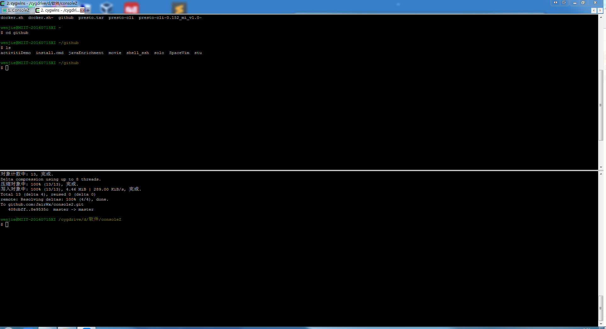

# console2
console2 windows的控制台 支持输入中文
上传至github便于编译环境的移植
显示效果:

---
## console2 基本了解
### 优势:
1. 支持多标签，这样就不会再任务栏里产生过多的窗口 
2. 不仅可以包装cmd.exe，也可以包装其他terminal程序，如cygwin、Powershell等等 
3. 支持透明背景，可配置字体和颜色，可配置热键等等 
4. 完全绿色，解压即用 images/22

### 相关问题
### 1. 无法输入中文的问题
解决：下载console.exe覆盖掉原来的就可以了